= PowerDesigner建模指南
:scripts: cjk
:toc: left
:toclevels: 3
:toc-title: 目录
:numbered:
:sectnums:
:sectnum-depth: 3
:source-highlighter: coderay

== PowerDesigner初始化设置

=== 设置字段显示comment注释

右键点击Entity ->`【Properties】`->`【Columns】`->`【Customize Columns and Filter】`->`【Comment】`->`【OK】`

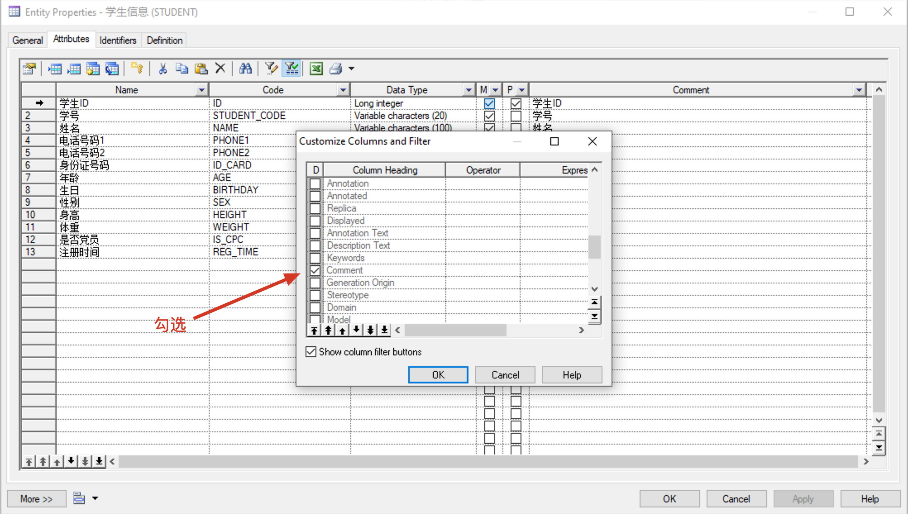

=== Entity同时显示Code和Name

`【Tools】` -> `【Display Preference】`

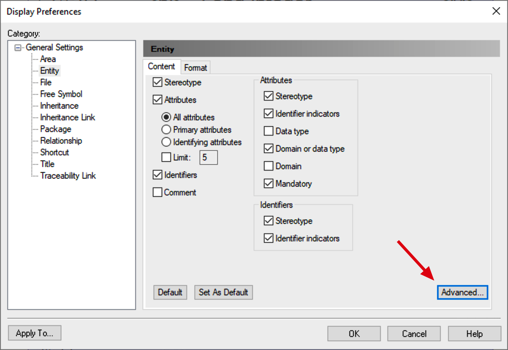
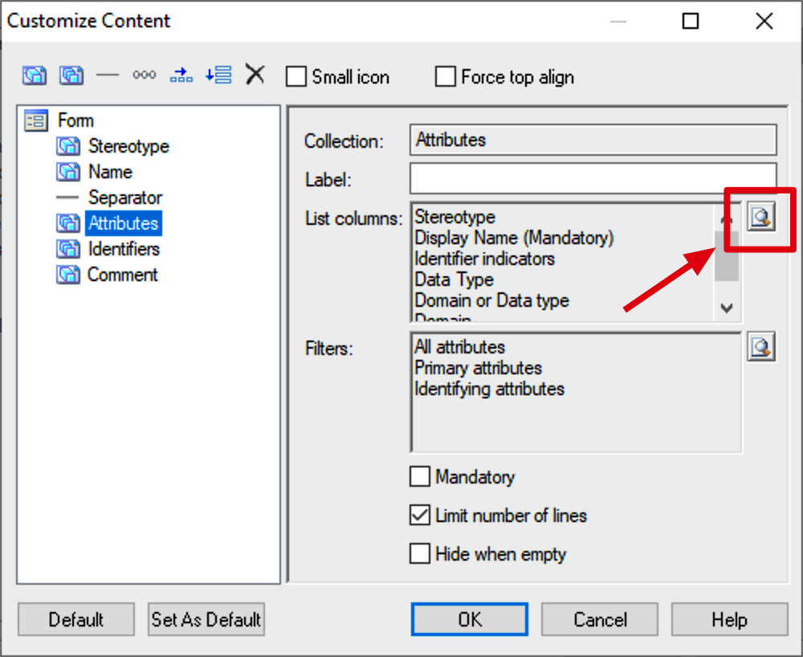
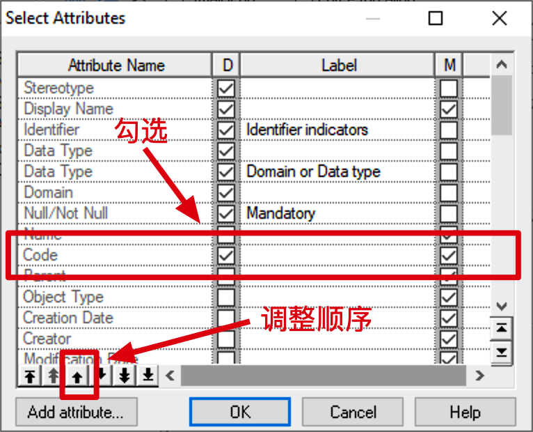

=== (PostgreSQL)修改生成索引名称规则

. 在物理模型生成创建数据库的脚本时，由于原来生成索引的规则问题，生成的索引在表名较长的情况下，有可能会重名
. `Database` > `Edit Current DBMS`
. `Scripts` > `Objects` > `Key` > `ConstName`
. 修改右侧的 `Value`
+
原: `AK_%.U18:AKEY%_%.U8:TABLE%`
+
改: `AK_%.U18:AKEY%_%.U30:TABLE%`

[NOTE]
====
请使用管理员来打开PowerDesigner，否则修改无法保存
====

=== 修改生成外键名称规则

. 在物理模型生成创建数据库的脚本时，由于原来生成外键的规则问题，生成的外键在表名较长的情况下，有可能会重名
. `Database` -> `Edit Current DBMS`
. `Scripts` -> `Objects` -> `Reference` -> `Create`
. 修改右侧的 `Value`
.. MySQL
+
原:
`alter table %TABLE%
alter table [%CQUALIFIER%]%CHILD% add [constraint %CONSTNAME% ]foreign key[%R%? %CONSTNAME%] (%FKEYCOLUMNS%)
references [%PQUALIFIER%]%PARENT%[ (%CKEYCOLUMNS%)][ %ReferenceMatch%][ on delete %DELCONST%][ on update %UPDCONST%]`
+
改: `alter table [%CQUALIFIER%]%CHILD% add [constraint fk_%FKEYCOLUMNS%__from__%PARENT% ]foreign key[%R%? %CONSTNAME%] (%FKEYCOLUMNS%)
references [%PQUALIFIER%]%PARENT%[ (%CKEYCOLUMNS%)][ %ReferenceMatch%][ on delete %DELCONST%][ on update %UPDCONST%]`

.. PostgreSQL
+
原: `alter table %TABLE%
add [constraint %CONSTNAME% ]foreign key (%FKEYCOLUMNS%)
references %PARENT%[ (%CKEYCOLUMNS%)]
[ on delete %DELCONST%][ on update %UPDCONST%][%Deferrable%? deferrable[%ForeignKeyConstraintDeferred%? initially deferred: initially immediate]]`
+
改: `alter table %TABLE%
add [constraint fk_%FKEYCOLUMNS%__from__%PARENT% ]foreign key (%FKEYCOLUMNS%)
references %PARENT%[ (%CKEYCOLUMNS%)]
[ on delete %DELCONST%][ on update %UPDCONST%][%Deferrable%? deferrable[%ForeignKeyConstraintDeferred%? initially deferred: initially immediate]]`

[NOTE]
====
请使用管理员来打开PowerDesigner，否则修改无法保存
====

== 建模流程

. 建立工作空间
. 建立项目
. 逻辑模型
. 物理模型
. 建库脚本

=== 建立工作空间

与Eclipse的工作空间类似，一个工作空间可以存放多个项目，**规范没有强制要求，只是建议一台电脑就用一个工作空间就好了**
::image:项目结构.png[项目结构]

=== 建立项目

项目的英文是 `Project`，新建项目请在菜单中选择 `New Project...`，具体操作略

=== 逻辑模型

==== 新建逻辑模型

逻辑数据模型的英文是 `Logical Data Model`，新建请在菜单中选择 `New Model...` > `Model types` > `Logical Data Model` > `Logical Diagram`，具体操作略

==== 设计逻辑模型

* 逻辑模型页面,创建表，添加字段 `New` -> `Entity`
* 每个表的code不用加项目前缀（在生成物理模型的时候再设置）
* 表和字段的code小写(Oracle为表和字段的code大写)，单词之间用下划线隔开
* 每个表必须有且有一个关键字段，code为 `ID`，如无特殊要求，数据类型请使用 `Long integer`
* 每个表的物理外键通过设置关系生成，无需手动设置物理外键
+
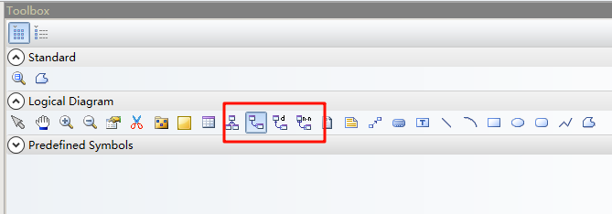
* (MySQL设置unique需要)在逻辑模型中设置Identifiers
+
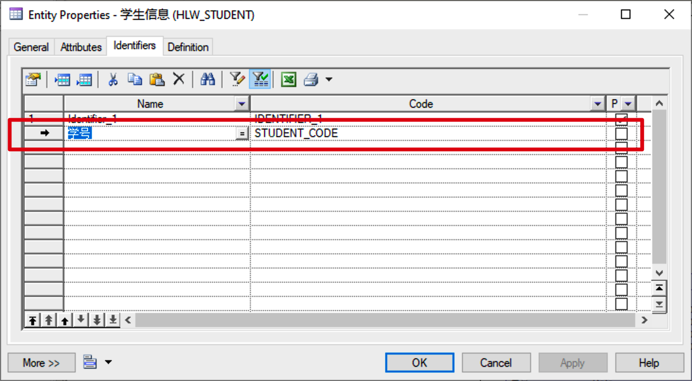

=== 物理模型

==== 生成物理模型

. 生成物理模型
+
打开逻辑模型 > 点击菜单 `Tools` -> `Generate Physical Data Model...` 或 直接 `Ctrl + Shift + p`
+
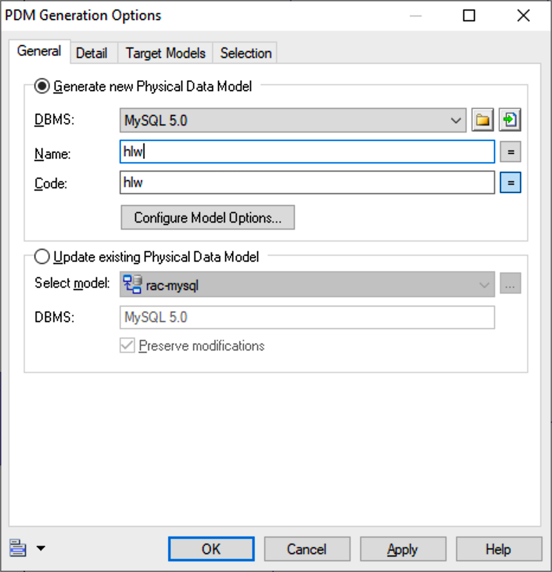
+
[NOTE]
====
如果是再次生成模型，请选择 `Update existing Physical Data Model` 选项
====
+
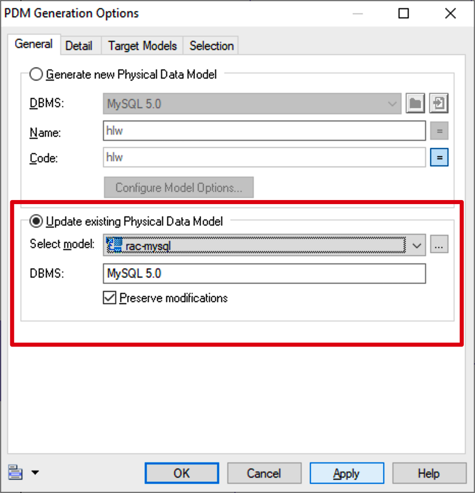
. 给表名统一设置前缀
+
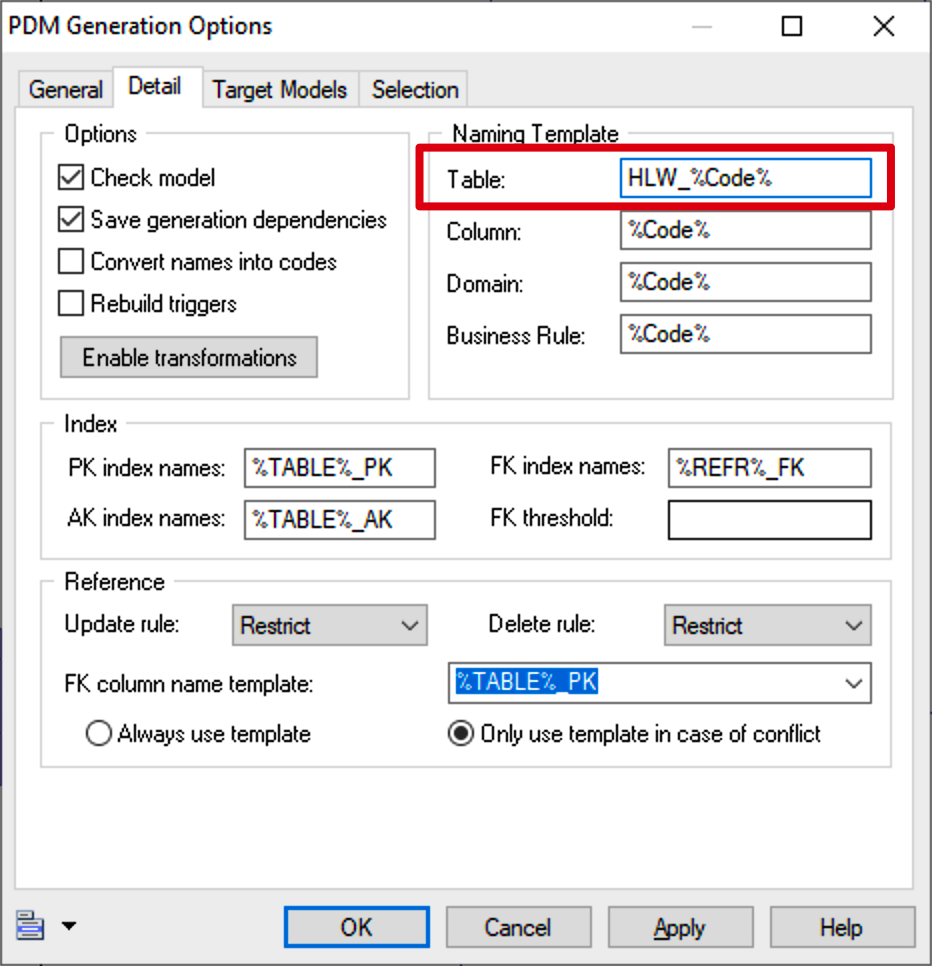

. (MySQL设置unique需要)再次生成物理模型时不要选中 `Ext Unique` 的项，以免被覆盖又得重新在物理模型中设置
+
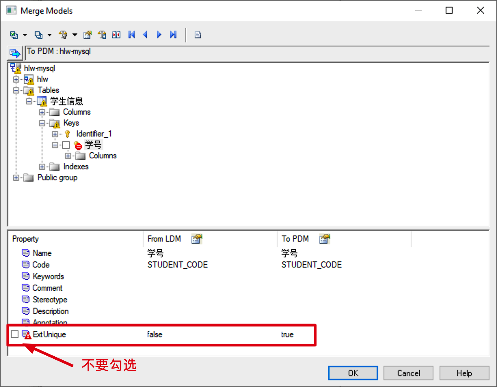
+
**建议: 设置生成物理模型时排除unique的比较**
+
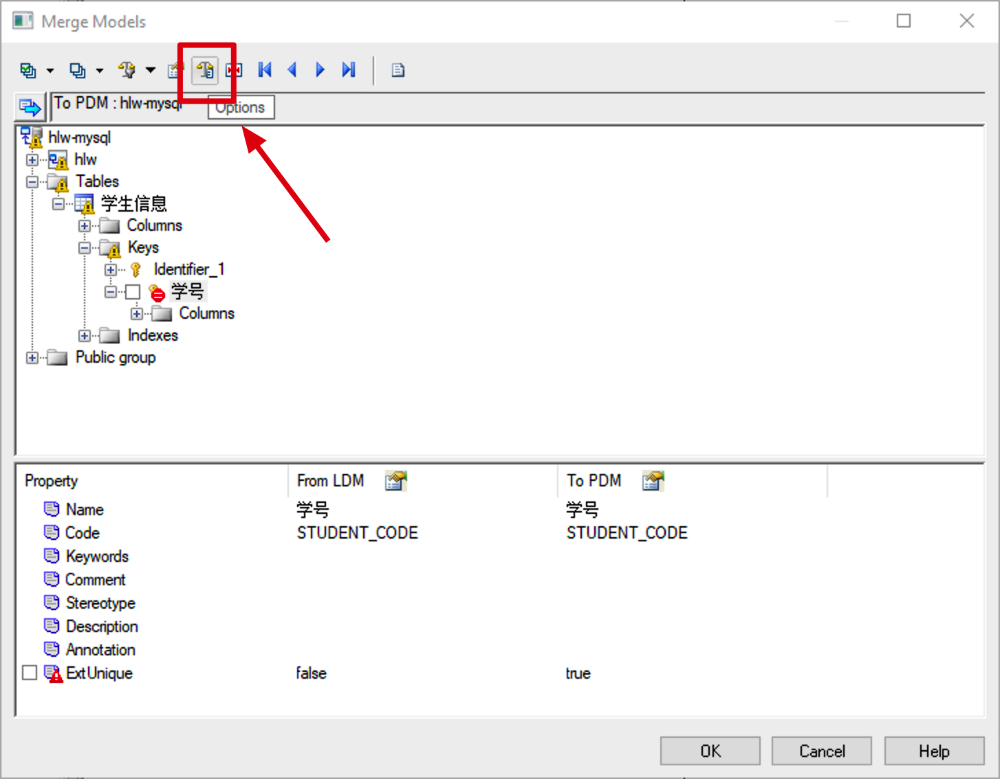
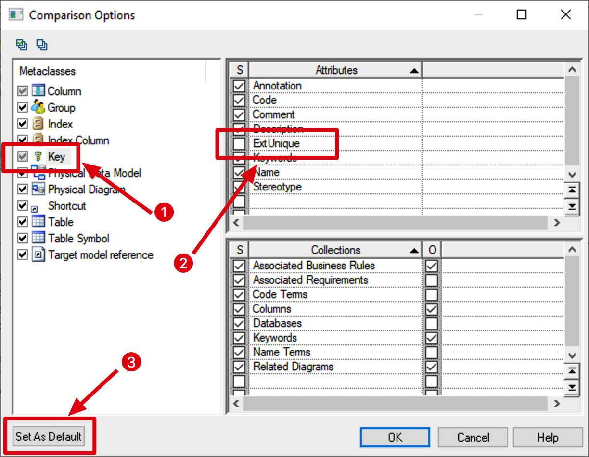

==== 补充设计物理模型

在逻辑模型中无法针对具体的数据库特性进行设计，所以要在物理模型中补充设计

===== (MySQL)设置unique字段

MySQL物理模型中 -> 双击表 -> 设置Keys，选择要修改的key，编辑 -> `MySQL` -> `Unique key`

[NOTE]
====
可以在生成脚本后查找脚本中是否有 ` key ` 来检查
====

=== 建库脚本

==== 生成建库脚本

. 点击菜单 `Database` -> `Generate Database...`，或者直接 `Ctrl + G`
. Formate页面的设置
+
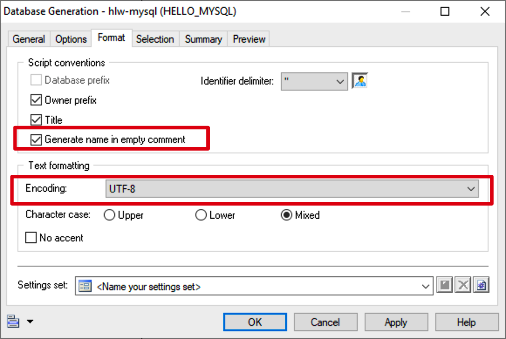

==== 补充修改建库脚本

. (MySQL)将bool替换为bit(1)，否则MySQL默认会转成tinyint(1)
. (MySQL)检查是否包含有 ` key ` 判断物理模型是否忘记设计unique

== 建库并执行脚本

不同数据库、不同工具，方式各不相同，这里略

=== 禁用外键约束

在执行脚本删除表时，有可能因为外键而导致删除不了表，这里就要临时禁用外键约束

* MySQL
+
[source,sql]
----
-- 会话内禁用外键约束
SET
FOREIGN_KEY_CHECKS = 0;
-- 会话内启用外键约束
SET
FOREIGN_KEY_CHECKS = 1;

-- 全局禁用外键约束
SET
GLOBAL FOREIGN_KEY_CHECKS = 0;
-- 全局启用外键约束
SET
GLOBAL FOREIGN_KEY_CHECKS = 1;
----
